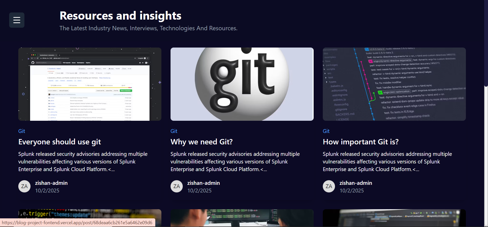
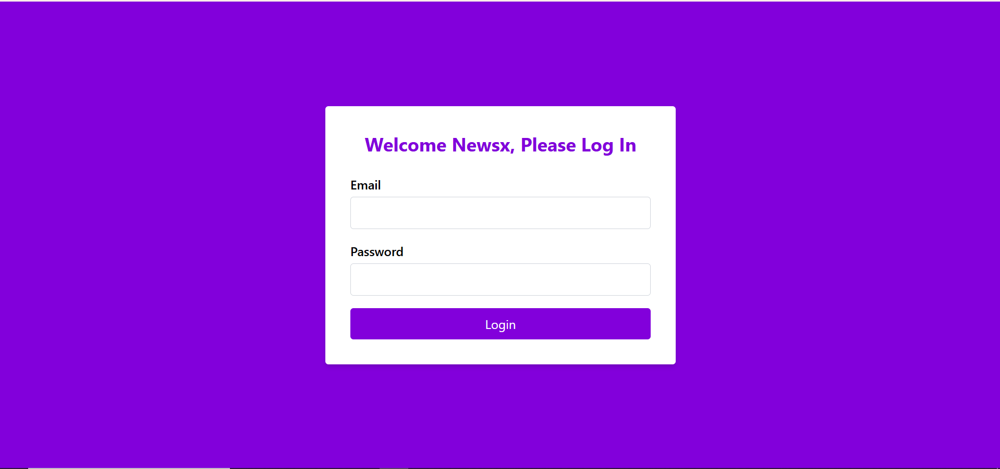
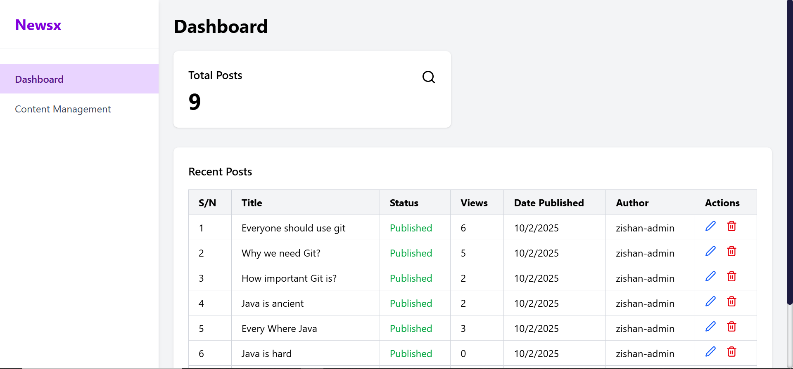
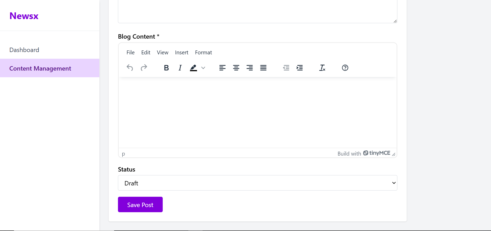

# New Blog Project

A modern React-based blog management system built with Vite, featuring a public blog viewer and an admin panel for content management.

## Screenshots

### Home Page



### Login Page



### Admin Dashboard



### Content Management Form



## Features

- **Public Blog Viewer**: Browse and read blog posts
- **Individual Blog Posts**: Detailed view for each post
- **Admin Authentication**: Secure login for content management
- **Dashboard**: Overview of blog statistics and management
- **Content Management**: Create, edit, and manage blog posts using a rich text editor (TinyMCE)
- **Responsive Design**: Built with TailwindCSS for mobile-friendly UI
- **Routing**: Client-side routing with React Router DOM

## Tech Stack

- **Frontend**: React 19, Vite
- **Styling**: TailwindCSS
- **Icons**: Lucide React
- **Rich Text Editor**: TinyMCE React
- **HTTP Client**: Axios
- **Routing**: React Router DOM
- **Linting**: ESLint

## Installation

1. Clone the repository
2. Navigate to the client directory:
   ```bash
   cd new-blog-project/client
   ```
3. Install dependencies:
   ```bash
   npm install
   ```

## Usage

### Development

Start the development server:

```bash
npm run dev
```

The application will be available at `http://localhost:5173`

### Build for Production

```bash
npm run build
```

### Preview Production Build

```bash
npm run preview
```

### Linting

```bash
npm run lint
```

## Project Structure

- `src/pages/`: Main application pages (Login, Dashboard, ContentManagement, BlogViewer, BlogPost)
- `src/components/`: Reusable UI components (Sidebar, BlogCard, Categories, YouMayLove)
- `src/assets/`: Static assets
- `public/`: Public assets

## Routes

- `/`: Public blog viewer (home page)
- `/post/:id`: Individual blog post view
- `/login`: Admin login page
- `/admin`: Admin dashboard (protected)
- `/admin/content-management`: Content management page (protected)

## Accessing Admin Panel

To access the admin panel for content management:

1. Navigate to `/login` in your browser
2. Enter your admin credentials (username and password)
3. Upon successful login, you'll be redirected to the admin dashboard at `/admin`
4. From the dashboard, you can access content management at `/admin/content-management`

**Note:** Admin credentials are managed separately and should be provided by the system administrator.

## Authentication

The application uses localStorage for simple token-based authentication. Admin routes are protected and redirect to login if not authenticated.

## Contributing

1. Fork the repository
2. Create a feature branch
3. Make your changes
4. Run linting: `npm run lint`
5. Submit a pull request

## License

This project is private and not licensed for public use.
